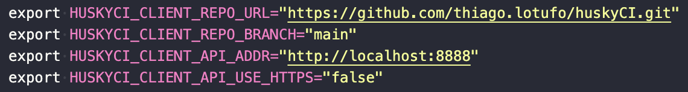
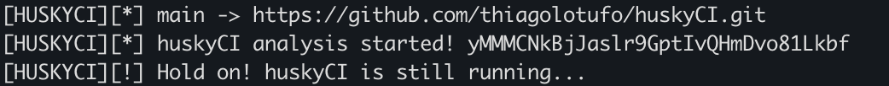
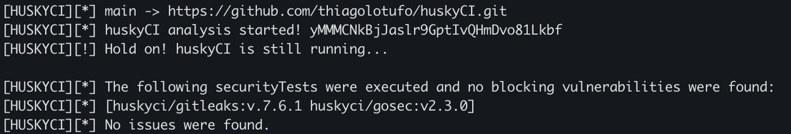

# Artigo HuskyCI SBSeg24

Para aumentar o nível de segurança nas aplicações, combinamos práticas de desenvolvimento seguro, processos e ferramentas. O HuskyCI é um orquestrador open source que integra diferentes ferramentas SAST e SCA em pipelines de desenvolvimento, e tem como objetivo buscar vulnerabilidades em tempo de desenvolvimento, identificando vulnerabilidades antes que estas cheguem em um ambiente produtivo. Neste documento, apresentamos as instruções necessárias para instalar, configurar e executar uma análise estática utilizando o HuskyCI.

Este repositório está vinculado ao artigo "HuskyCI: um orquestrador de testes de segurança em software para ciclos ágeis de desenvolvimento", submetido ao VIII Salão de Ferramentas do 24º Simpósio Brasileiro em Segurança da Informação e de Sistemas Computacionais (SBSeg).

Resumo do artigo: "DevSecOps combina desenvolvimento, segurança e operações para criar um processo ágil e seguro de entrega de software. A metodologia promove a integração da segurança no ciclo de desenvolvimento, o que diminui custos e esforços de correção. As pipelines de CI/CD automatizam o fluxo do código desde a construção até a produção, enquanto ferramentas SAST e SCA detectam vulnerabilidades de segurança. Neste artigo, apresentamos o HuskyCI, uma ferramenta de código aberto que orquestra testes de segurança em pipelines CI, oferecendo suporte a múltiplas linguagens e integração com ferramentas existentes. Conduzimos uma avaliação sobre tempo de execução dos testes e concluímos que ele não compromete o ciclo de desenvolvimento ágil dos projetos."

## Resumo

Neste repositório, está contido o código da aplicação HuskyCI, bem como o link para documentação oficial, todos os passos necessários para executar o HuskyCI em uma máquina MacOS ou Linux, desde que possua o ambiente com as dependências necessárias instaladas. 

O README deste repositório também possui todos os passos necessários para executar o HuskyCI em uma máquina MacOS ou Linux, desde que possua o ambiente com as dependências necessárias instaladas. 
De maneira geral, o README apresenta informações como (i) Lista de dependências necessárias; (ii) Preparação do ambiente; (iii) Execução da ferramenta; (iv) Descrição do ambiente de execução; (v) Exemplo de execução.

### Depencências

As dependências necessárias para execução da ferramenta são:

- Sistema operacional macOS Big Sur 11.7 ou superior ou Linux Debian 11 ou superior, com arquitetura amd64 ou arm64;
- Docker Desktop 4.0.0 ou superior;
- Git versão 2 ou superior;
- Make 3.81 para execução de um Makefile;
- OpenSSL 3.0 ou superior (em casos de repositório privado);
- GoLang versão 1.20 ou superior.

<strong>Observação:</strong> O HuskyCI é compatível com a arquitetura arm64m desde que as versões das ferrmanetas especificadas neste repositório não sejam modificadas.

Para instalar as dependências utilizando um script `shell`, basta executar os seguintes comandos:

```sh
chmod +x env/prepare-env-<YOUR-OS>.sh
```

```sh
./env/prepare-env-<YOUR-OS>.sh
```

### Preparação do Ambiente

Para preparar o ambiente de execução do HuskyCI, é necessário instalar todas as dependências especificadas. Com o Docker instalado, basta executar os comandos contidos no arquivo `Makefile`.

1. Realizar o clone da ferramenta no repositório `https://github.com/thiagolotufo/huskyCI.git`:
```sh 
git clone https://github.com/thiagolotufo/huskyCI.git
```

2. Acessar o diretório raiz da ferramenta:
```sh
cd huskyCI
```

3. Este comando é reponsável por iniciar os containers da API, banco de dados e Docker API, junto com a criação dos certificados e geração das variáveis de ambiente:
```sh
make install
```

4. Exportar as variáveis de ambiente criadas no passo anterior:
```sh
source .env
```

### Execução da ferramenta

Para executar a ferramenta após preparar todo o ambiente, basta executar o comando a seguir. Este comando é reponsável por iniciar a análise e acompanhar seu status.

```sh
make run-client
```

### Descrição do ambiente de execução

Toda a execução é feito utilizando containers Docker. Ao preparar o ambiente, são criados três containers, contendo a API do Husky, o banco de dados MongoDB e o Docker-in-Docker reponsável por criar os containers com as ferramentas de segurança. O arquivo `.env` pode ser modificado, inserindo os valores de URL e Branch do repositório que deseja analisar. 

Após a execução da análise, com o comando `make run-client`, será feita uma requisição para o container da API, contendo as informações especificadas no `.env`. Na API, uma nova tarefa é iniciada, dando início a uma nova análise de código. Os containers contendo os testes de segurança serão criados no Docker-in-Docker, conforme as linguagens identificadas no repositório. 

Durante o período da análise, o client realiza requisições constantes para a API, obtendo o status da execução. Ao finalizar a análise, os resultados são enviados para o client, que por sua vez imprime as informações recebidas no terminal do usuário.

<strong>OBSERVAÇÃO:</strong> Para execução do HuskyCI em um repositório, é necessário alterar o valor das variáveis `HUSKYCI_CLIENT_REPO_URL` e `HUSKYCI_CLIENT_REPO_BRANCH` com o repositório e branch de destino no arquivo `.env`, respectivamente. Após realizar esta alteração, é necessário exportar o arquivo `.env` novamente, exeutando o <strong>item 4</strong> da sessão [Preparação do Ambiente](#preparação-do-ambiente) deste `README.md`.

### Exemplo de execução

Neste exemplo, utilizaremos o próprio repositório da ferramenta. Para esta execução, é necessário editar o arquivo `.env` gerado de forma automática durante a preparação do ambiente.



Após iniciar a análise, um ID será gerado e o client começa a executar requisições temporizadas para a API, com o objetivo de identificar o status da execução. 



Ao finalizar a análise, os resultados obtidos através dos testes de segurança são impressos no terminal do usuário



Neste caso, não foram encontradas vulnerabilidades no código do HuskyCI. 

### Configurações de ambiente utilizadas

- Sistema Operacional: MacOS Sonoma 14.4.1
- Arquitetura do Sistema: ARM64
- Docker version 27.0.3
- GNU Make 3.81
- OpenSSL 3.3.0
- Go 1.22.5 darwin/arm64

### Documentação oficial do HuskyCI

Para acessar a documentação oficial da ferramenta, é necessário acessar este [link](https://huskyci.opensource.globo.com/docs/overview/).
Para acessar o repositório Open Source, com o README oficial da ferramenta e todas as contribuições realizadas, é necessário acessar este [link](https://github.com/globocom/huskyCI).